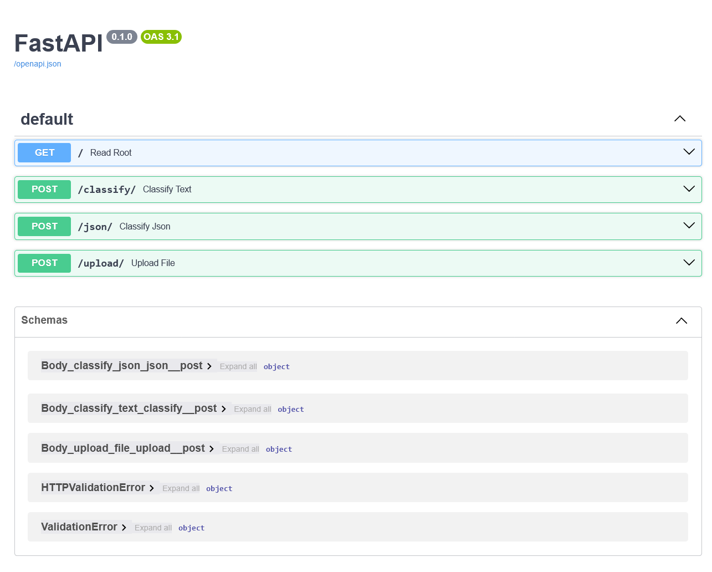
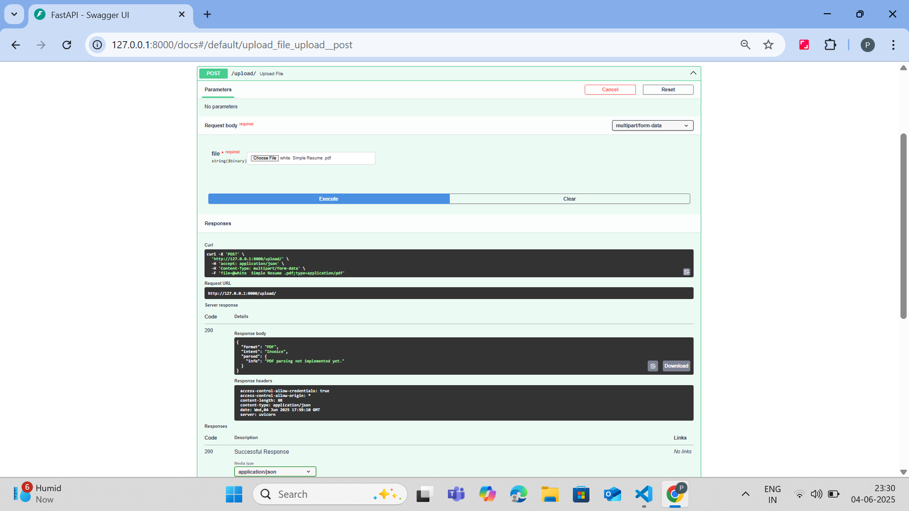
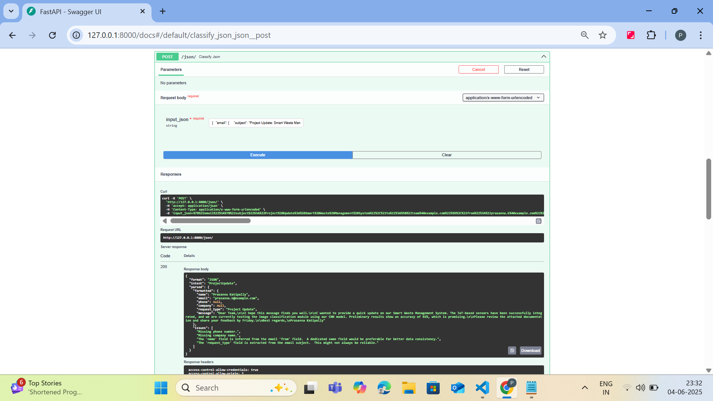
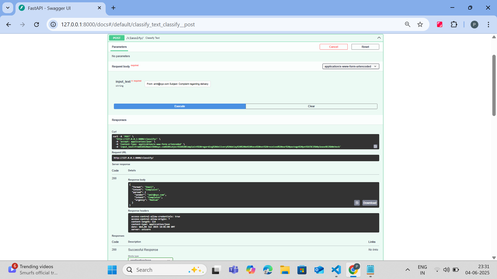

# 🧠 Flowbit AI Agent Development Project

> Multi-Agent System to parse Email, JSON & PDF inputs with Format + Intent Classification, Routing, and Context Memory.

---

## 🚀 Project Overview

This project implements a smart AI workflow to:
- Accept data in **Email**, **JSON**, or **PDF**
- **Classify Format + Intent** (e.g., Invoice, RFQ, Complaint, Regulation, etc.)
- **Route** to specialized agent
- **Parse** the content and return structured results
- Store in a **Shared Memory** module (SQLite)

---

## 🗂️ Folder Structure
```
ai-agent-flowbit/
│
├── agents/
│   ├── classifier_agent.py      # Classifies format + intent
│   ├── email_agent.py           # Parses sender, intent, urgency
│   └── json_agent.py            # Reformats JSON, finds anomalies
│
├── memory/
│   └── memory_store.py          # SQLite shared memory store
│
├── mcp/
│   └── orchestrator.py          # Orchestrates input flow
│
├── data/
│   ├── sample_email.txt
│   ├── sample_json.json
│   └── sample_invoice.pdf       # (mocked / future use)
│
├── utils/
│   └── helpers.py               # (Optional)
│
├── tests/
│   ├── test_classifier.py       # Test script for classifier
│   ├── test_email_agent.py      # Test script for email agent
│   ├── test_json_agent.py       # Test script for JSON agent
│   ├── test_memory.py           # View SQLite stored results
│   └── test_orchestrator.py     # Full pipeline test
│
├── main.py                      # FastAPI app
├── requirements.txt             # Python dependencies
├── .env                         # API key config
└── README.md                    # This file
```

---

## ⚙️ Tech Stack

- **Python 3.10+**
- **FastAPI** (API interface)
- **Google Gemini Pro** (via `google-generativeai`)
- **SQLite** (shared memory)
- **Pydantic** (data validation)
- **pytest** (testing)

---

## 🔐 Environment Setup

1. Create `.env` file:
```bash
GEMINI_API_KEY=your_google_api_key_here
DB_PATH=./memory/memory.db
```

2. Install dependencies:
```bash
pip install -r requirements.txt
```

---

## 🏃‍♂️ Quick Start

```bash
uvicorn main:app --reload
```
Access Swagger UI at: http://127.0.0.1:8000/docs

---

## 🧪 API Endpoints

| Endpoint    | Input                  | Output                          |
|-------------|------------------------|---------------------------------|
| `POST /classify` | Raw text/email         | Format + intent + metadata      |
| `POST /process_json` | JSON string       | Validated/annotated JSON        |
| `POST /upload`    | File (PDF/TXT)     | Parsed structured data          |

---

## 🧠 Memory System

```python
# Example memory record
{
    "timestamp": "2024-03-15T12:00:00Z",
    "format": "email",
    "intent": "complaint",
    "source": "user@domain.com",
    "parsed_data": {...},
    "agent_version": "1.0.0"
}
```

---

## 📸 Screenshots

  
 
 
 

*API Documentation Interface*


---

## ✅ Quality Assurance

```bash
# Run all tests
pytest tests/
```

Test coverage includes:
- Format detection accuracy
- Intent classification
- JSON schema validation
- Memory persistence

---

## 📜 License

MIT License - See [LICENSE](LICENSE) for details.
